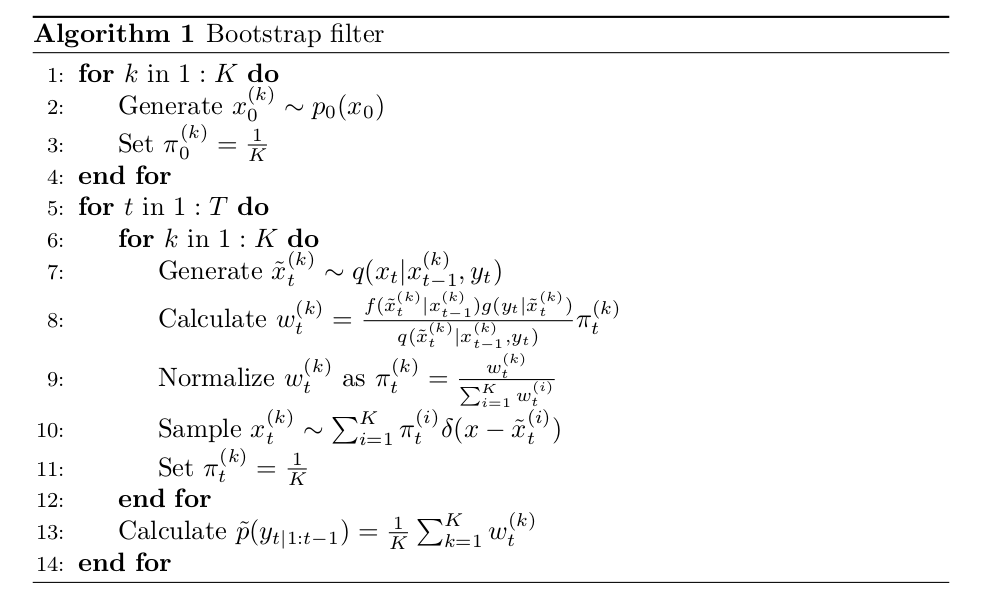
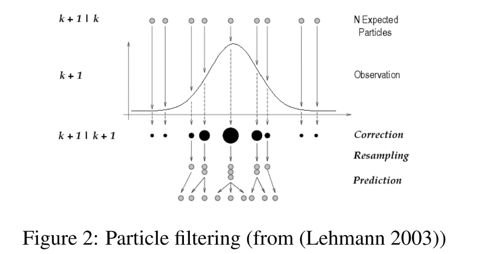

<style>
slides > slide {
  overflow-x: auto !important;
  overflow-y: auto !important;
}
</style>

```{r chunksetup, include=FALSE} 
library(nimble)
has_stochvol <- require(stochvol)
if(!has_stochvol)
  message("Some examples in this module use the stochvol (stochastic volatility) package.")
```

Material here is based on a paper that will appear in Journal of Statistical Software and is current on arXiv:

[*Sequential Monte Carlo methods in the nimble R package* (Michaud et al. 2020)](https://arxiv.org/abs/1703.06206)

# Sequential Monte Carlo


Sequential Monte Carlo is a family of algorithms for iteratively sampling from a posterior distribution generally in state-space style models:

$$ y_t \sim g_t(y_t | x_t, \theta)$$
$$ x_t \sim f_t(x_t | x_{t-1}, \theta) $$ 

Some goals in analyzing such models include:

 - filtering (online estimation): determining $p(x_T | y_{1:T}, \theta)$
 - smoothing: determining the (conditional) posterior $p(x_{1:T} | y_{1:T}, \theta)$
 - parameter estimation: determining $p(\theta | y_{1:T})$ 
 - likelihood calculation: determining $p(y_{1:T} | \theta)$

Parameter estimation is generally a hard problem in this context, with ongoing research.

# Some SMC methods

Some of the methods in the family of SMC and related algorithms include:

 - bootstrap filter
 - auxiliary particle filter
 - Liu and West filter and iterated filtering 2
 - particle MCMC
 - ensemble Kalman filter

This is just a partial list, focused on methods included in NIMBLE.

# Particle filtering: basic ideas

The basic idea is to approximate the filtering distribution using a sample. We start with an initial sample (not conditioned on the data) and then propagate the sample forward in time, reweighting each element of the sample based on how well it matches the model density at time t (i.e., the prior for $x_t$ and likelihood for $y_t$), and then sampling the new set of particles based on the weights. 

This treats $\theta$ as known, so it does not appear in the notation.

Here's pseudo-code for the bootstrap filter, where

   - $q$ is a proposal distribution that propagates the sample forward in time
   - $w_t$ and $\pi_t$ are (unnormalized) weights and (normalized) weights

<center></center>


# Particle filtering: basic ideas (2)

Graphically, one might think of it this way:

<center></center>

# Improving particle filtering

Two key issues arise in these algorithms:

 - How to find a good $q(\cdot)$ proposal function so that the propagated particles have high model density given the next observation.
 - How to avoid particle degeneracy, where one or a few particles are the only 'good' particles and all the sample weight concentrates on those.

A wide variety of methods have been proposed to address these issues. 

# Bootstrap filter (basic method)

The original particle filter of [Gordon et al. (1993)](https://doi.org/10.1049/ip-f-2.1993.0015) used:

- $q(x_t | x_{t-1}^{(k)}, y_t) = f_t(x_t | x_{t-1}, \theta)$
- In other words, draw from the stochastic state dynamics, ignoring the data.

# Auxiliary particle filter (improved method)

A fundamental improvement is due to [Pitt and Shephard (1999)](https://www.tandfonline.com/doi/abs/10.1080/01621459.1999.10474153).  They use:

- For each $x_{t-1}$ sample, make initial forward trial by any desired method (simulation from $f_t(x_t | x_{t-1}, \theta)$, mean prediction, or other).
- Make preliminary weights based on closeness of each trial to data $y_t$.
- Resample $x_{t-1}$ based on initial trials.
- Use bootstrap filter (or other) from the resampled $x_{t-1}$.
- First-stage (trial) and second-stage (bootstrap filter or other) weights are combined.
- The result should be better choice of state particles at t-1 from which to propagate to states at time t.

# Particle MCMC

Note that at each step, one can get a Monte Carlo estimate of $p(y_t|y_{1:t-1}, \theta)$, so one can multiply to estimate $p(y_{1:T}|\theta)$.

Recall that for MCMC,

   - High-dimensional latent process values in non-conjugate models often result in bad mixing.
   - Ideally, we'd like to integrate over $x_{1:T}$ and do MCMC only on hyperparameters, $\theta$.
   - SMC algorithms allow us to estimate the marginal likelihood.
   - It turns out SMC marginal likelihood estimates can be used within MCMC for the hyperparameters.
   - The result is "exact approximate".  This means the posterior is sampled exactly correctly even though the marginal likelihood estimates are approximate.
   - The underlying theory ("pseudo-marginal likelihood") is to view the particle filter as drawing a sample from the smoothing distribution as part of the MCMC, even if that sample is never actually retained.
   - In practice, a Monte Carlo estimate of the likelihood with correct expected value (which particle filters satisfy) will be valid.
   
References:

- PMCMC: [*Particle Markov Chain Monte Carlo Methods.* (Andrieu et al. 2010)](https://doi.org/10.1111/j.1467-9868.2009.00736.x) 
- Pseudo-marginal likelihoods: [*The Pseudo-Marginal Approach for Efficient Monte Carlo Computations* (Andrieu and Roberts 2009)](https:://doi.org/10.1214/07-AOS574)


# Stochastic volatility example

Here's a common SMC example, following Pitt and Shephard (1999). The idea is that financial time series often have time-varying variability that is of interest to financial folks.

Let $r_t$ be the exchange rate at time $t$ and $y_t$ be the daily log return of the exchange rate, $y_t = (\log(r_t) - \log(r_{t-1}))$. A standard stochastic volatility model is

$$ y_t \sim N\left(0, \left( \beta \exp\left(\frac{x_t}{2}\right)\right)^2\right), $$

$$ x_t \sim N(\phi x_{t-1}, \sigma^2) $$


Here $\beta$ is the constant volatility while $x_t$ is the latent evolving volatility. 

For our basic SMC implementation we'll take $\beta$, $\sigma^2$, and $\phi$ to be known values, but we'll do inference on them via particle MCMC in the next module.

# Stochastic volatility BUGS code

```{r, sv-code}
stochVolCode <- nimbleCode({
  x[1] ~ dnorm(0, sd = sigma / sqrt(1-phi*phi))
  y[1] ~ dnorm(0, sd = beta * exp(0.5*x[1]))
  for(t in 2:T){
        ## time-evolving volatility
        x[t] ~ dnorm(phi * x[t-1], sd = sigma)
        ## observations
        y[t] ~ dnorm(0, sd = beta * exp(0.5*x[t]))
  }
  phi <- 2 * phiStar - 1
  phiStar ~ dbeta(20, 1.1)
  logsigma2 ~ dgammalog(shape = 0.5, rate = 1/(2*0.1)) ## This is Omega
  sigma <- exp(0.5*logsigma2)
  mu ~ dnorm(-10, sd = 1) 
  beta <- exp(0.5*mu)
})

dgammalog <- nimbleFunction(
  run = function(x = double(), shape = double(),
                 rate = double(),log = integer(0, default = 0)) {
    logProb <- shape * log(rate) + shape * x - rate * exp(x) - lgamma(shape)
    if(log) return(logProb)
    else return(exp(logProb))
    returnType(double())
  }
)

rgammalog <- nimbleFunction(
  run = function(n = integer(),
                 shape = double(), rate = double()) {
    xg <- rgamma(1, shape = shape, rate = rate)
    return(log(xg))
    returnType(double())
  }
)
```

```{r, include=FALSE}
# only needed for Rmd compilation; not needed for regular usage.
assign('dgammalog', dgammalog, .GlobalEnv)
assign('rgammalog', rgammalog, .GlobalEnv)
```

See our [arXiv paper](https://arxiv.org/pdf/1703.06206.pdf) (to appear in Journal of Statistical Software) for discussion of the priors and transformations above.

The `dgammalog` distribution is the opposite of the log-gamma distribution. 

# Stochastic volatility filtering

Now let's create the model and apply and run a bootstrap filter.

We use as data the exchange rates for the Euro (EUR) quoted in U.S. Dollars (USD) starting after January 1st, 2010, and continuing until the end of the time-series, 582 days after that.

```{r, sv-model}
library("stochvol")
data("exrates")
y <- logret(exrates$USD[exrates$date > '2010-01-01'], demean = TRUE)
TT <- length(y)

stochVolModel <- nimbleModel(code = stochVolCode,
                             constants = list(T = TT), data = list(y = y),
                             inits = list(mu = -10, phiStar = .99,
                                          logsigma2 = log(.004)))
CstochVolModel <- compileNimble(stochVolModel)
```

```{r, sv-filter}
svBootFilter <- buildBootstrapFilter(stochVolModel, nodes = 'x',
                       control = list(saveAll = TRUE, thresh = 1.0))
cSvBootFilter <- compileNimble(svBootFilter, project = stochVolModel)
cSvBootFilter$run(10000)
samples <- as.matrix(cSvBootFilter$mvEWSamples) ## equally-weighted samples from filtering distribution
```

# Stochastic volatility results

Here's the estimated volatility based on the filtering distribution, so not the full posterior estimate. There are algorithms that produce the smoothing distribution, though the one implemented in NIMBLE for the bootstrap filter is a basic one. 

```{r, sv-results, fig.width=10, fig.height=6, fig.cap=''}
par(mfrow = c(1,2))
ts.plot(y, main = 'observations')
mn <- apply(samples, 2, mean)
qs <- apply(samples, 2, quantile, c(.025, .975))
ts.plot(mn, ylim = range(qs), main = 'estimated volatility')
lines(1:TT, qs[1, ], lty = 2)
lines(1:TT, qs[2, ], lty = 2)
```


# SMC algorithm implementation

Our SMC algorithms are implemented using nimbleFunctions (of course!).

Each time step has its own nimbleFunction, because we need fully model-generic calculations that can't assume any particular structure for a given time step (and at the moment NIMBLE can't easily store model dependencies for multiple nodes in a single data strucutre).

We'll look directly at the code in [`filtering_bootstrap.R`](filtering_bootstrap.R).

The overall filtering nimbleFunction simply iterates through each individual time step function and builds up the overall likelihood from the time step-specific pieces.


# Lists of nimbleFunctions

The bootstrap filter created a list of nimbleFunctions, one for each time step. Here's what the code in the overall bootstrap filter nimbleFunction setup code looks like:

```{r, nimbleFunctionLists, eval=FALSE}
bootStepFunctions <- nimbleFunctionList(bootStepVirtual)
for(iNode in seq_along(nodes)){
  bootStepFunctions[[iNode]] <- bootFStep(model, mvEWSamples, mvWSamples,
                                          nodes, iNode, names, saveAll,
                                          smoothing, resamplingMethod,
                                          silent) 
}
```

The key steps are:

   - define a 'virtual' nimbleFunction that is a *base class* (basically a skeleton function)
   - define a *nimbleFunctionList* based on that virtual nimbleFunction
   - create each individual nimbleFunction by calling a nimbleFunction generator that inherits from the virtual nimbleFunction

Then one can call the run function or other run-time methods of the elements of the list of nimbleFunctions in the run code of the overall nimbleFunction.

Similarly, an MCMC is composed of a list of individual sampler functions (of which we've seen many examples) specialized to nodes of a model.


# Particle MCMC

Note that at each step, one can get a Monte Carlo estimate of $p(y_t|y_{1:t-1}, \theta)$, so one can multiply to estimate $p(y_{1:T}|\theta)$.

Recall that for MCMC,

   - High-dimensional latent process values in non-conjugate models often result in bad mixing.
   - Ideally, we'd like to integrate over $x_{1:T}$ and do MCMC only on hyperparameters, $\theta$.
   - SMC algorithms allow us to estimate the marginal likelihood so could be embedded within MCMC for the hyperparameters.

# Particle MCMC in NIMBLE

NIMBLE provides scalar and block random-walk Metropolis Hastings based on this approach: "Particle Marginal Metropolis Hastings".

Simply specify 'RW_PF' or 'RW_PF_block' in *addSampler*, indicating the $x_{1:T}$ nodes as part of the control argument.

We'll look directly at the PMCMC code in [`pmcmc_samplers.R`](pmcmc_samplers.R), which is simply the PMCMC samplers extracted from *MCMC_samplers.R* file in the nimble R package.

The setup code creates a filtering algorithm, and then the run code runs it under the proposed hyperparameter values and uses the likelihood approximation in the Metropolis-Hastings acceptance calculation.


# Stochastic volatility, particle MCMC

```{r, sv-pmcmc}
# `nodes=NULL` sets up a configuration with NO samplers
stochVolMCMCConf <- configureMCMC(stochVolModel, nodes = NULL,
                              monitors = c('mu', 'beta', 'phiStar', 
                                           'phi', 'logsigma2', 'sigma'))

if(FALSE) {
  # one can build one own's particle filter and then provide it as control$pf
  auxpf <- buildAuxiliaryFilter(stochVolModel, 'x', 
                                control = list(saveAll = FALSE, 
                                               smoothing = FALSE,
                                               initModel = FALSE))
}

h <- 1
propSD <- h * c(0.089, 0.039, 1.45)
m <- 200
stochVolMCMCConf$addSampler(target = c('mu', 'phiStar', 'logsigma2'),
                            type = 'RW_PF_block',
                            control = list(propCov = diag(propSD^2),
                                           pfType = 'auxiliary',
                                           adaptive = TRUE,
                                           pfNparticles = m,
                                           latents = 'x'))

stochVolMCMC <- buildMCMC(stochVolMCMCConf)
cMCMC <- compileNimble(stochVolMCMC, project = stochVolModel, resetFunctions = TRUE)
samples <- runMCMC(cMCMC, 5000)		       
```

# Stochastic volatility, particle MCMC results

It looks like the MCMC worked somewhat well.

```{r, sv-pmcmc-results, fig.width=12, fig.height=8, fig.cap=''}
par(mfrow = c(2, 3))
ts.plot(samples[ , 'beta'], main = 'beta')
ts.plot(samples[ , 'phi'], main = 'phi')
ts.plot(samples[ , 'sigma'], main = 'sigma')
## posteriors on scale of fixed values used in filtering earlier
hist(samples[ , 'mu'])           # fixed value was -10
hist(samples[ , 'phiStar'])      # fixed value was 0.99
hist(samples[ , 'logsigma2'])    # fixed value was -5.5
```

# Maximum likelihood for the stochastic volatility example

We can also consider trying to use maximum likelihood to estimate the (hyper)parameters. 

Given the integration of the volatility process is not possible analytically, there are two potential approaches in NIMBLE:

  - MCEM (use MCMC to approximate the required expectation in the EM algorithm)
  - IF2 SMC-based approach (not shown here; please see the arXiv preprint for our JSS paper)
  
# MCEM 

 - Recall that the EM algorithm maximizes the expected log likelihood, where the expectation is over the 'missing data'.
 - If that expectation can't be done in closed form, we need a way to estimate it.
 - MCMC is one way - it's an MCMC over the 'missing data' given the current values of parameters we are maximixing with respect to.
 - Given NIMBLE's MCMC engine, this is a natural 'hybrid' algorithm for NIMBLE to be a good platform for.
 - Some hurdles:
    - When to stop?
    - How many MCMC iterations at each step; how much burn-in?
    - Can be quite slow because of the MCMC and often slow convergence of EM generally.

Caffo et al. (2005) Ascent-based MCEM helps to address stopping and determination of MCMC steps in an adaptive fashion.

# MCEM in practice

```{r}
## For real usage, you'd probably want to run a test MCMC sampling just 'x' given your 
## your initial parameter values to check if the burnin is sufficient.
## C=0.01 relaxes the convergence criterion for faster usage in this demo.
stochVolMCEM <- buildMCEM(CstochVolModel, burnIn = 200, latentNodes = 'x', C = 0.01)

## what are the initial values? We'll change them to be further away from the posteriorm means to see what we can see aboug convergence.
params <- stochVolModel$getNodeNames(topOnly = TRUE)
values(CstochVolModel, params)
CstochVolModel$mu <- -9
CstochVolModel$phiStar <- 0.8
CstochVolModel$logsigma2 <- -6
MLEs <- stochVolMCEM$run(initM = 1000)
MLEs
```


When we were exploring this model as part of our work for our JSS paper on SMC, we realized that there is not a lot of information in the data to estimate the parameters via maximum likelihood, so there are some shortcomings to using this example with MCEM. But it does illustrate the idea and usage.

Note that some of the parameters have bounded domains. NIMBLE's MCEM will attempt to figure that out, but you may also want to set the parameter constraints manually. 

# buildMCEM code

`buildMCEM` is actually just a function, not a nimbleFunction (but the MCMC that is used is a compiled NIMBLE MCMC). The reason for this is that the heavy computation is in the MCMC, so running the overall EM iterations in R does not slow things down.
